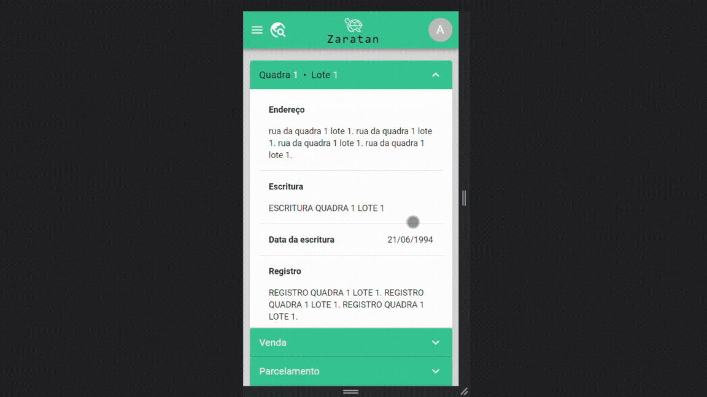
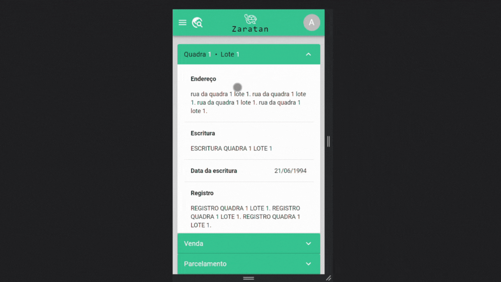

<h1>
  <span>Zaratan</span>
  
  
</h1>

A aplicação se trata de um website que provê um sistema de gestão de loteamentos ao usuário, disponibilizando serviços como criação, leitura, atualização e remoção de lotes. Os lotes são agrupados por quadras, as quais podem ser buscadas por meio de um dos serviços da aplicação.

O projeto se iniciou pela demanda de minha família por um sistema otimizado capaz de tornar nossas operações internas mais eficientes, com possibilidade de serem feitas remotamente de forma segura e zelando pela consistência e organização das informações.

<details>
<summary><strong>Ferramentas utilizadas</strong></summary>

- Front-end:
  - [ReactJS](https://reactjs.org/)
  - [React Router](https://reactrouter.com/en/main)
  - [Axios](https://axios-http.com/docs/intro)
  - [Material-UI](https://mui.com/)
  - [Eslint](https://eslint.org/)
  - [Stylelint](https://stylelint.io/)
- Back-end:
  - [Golang](https://go.dev/)
  - [Go Fiber](https://gofiber.io/)
  - [JSON Web Tokens](https://jwt.io/)
  - [MySQL](https://www.mysql.com/)
- Testes E2E:
  - [Jest](https://jestjs.io/)
  - [Puppeteer](https://pptr.dev/)
- Geral:
  - [Docker](https://www.docker.com/)

</details>

<details>
  <summary><strong>Pré-visualização</strong></summary>
  <blockquote>
    <details>
      <summary>Tela de login</summary>
      
    </details>
    <details>
      <summary>Tela de lotes - Informações de um lote</summary>
      
    </details>
    <details>
      <summary>Tela de lotes - Paginação e sistema de rolagem</summary>
      
    </details>
    <details>
      <summary>Tela de lotes - Busca</summary>
      
    </details>
    <details>
      <summary>Tela de registro de lote</summary>
      
    </details>
    <details>
      <summary>Tela de edição de lote</summary>
      
    </details>
  </blockquote>
</details>

<details>
<summary><strong>Iniciando aplicação</strong></summary>

⚠️ A aplicação usa localStorage do browser para autenticação de usuário. ⚠️

<h1>Docker</h1>

- ⚠️ Docker-compose precisa estar na versão 3.9.

1. Abra um terminal e clone o repositório. Mude para a pasta raíz do repositório:
```bash
git clone git@github.com:pennaor/zaratan.git
cd ./zaratan
```

2. Crie um arquivo chamado `.env` na raíz do repositório a partir do template `.env.example`. Edite conforme necessidade.

3. Execute o comando para build e inicialização dos containers referentes aos serviços da aplicação:
```bash
docker-compose -f docker-compose-dev.yml up -d
```

<h2>Notas</h2>

- Front-end e back-end utilizam bibliotecas que detectam alterações no código-fonte e reexecutam a aplicação.
- São criados volumes para o código-fonte do front-end e back-end, de forma a refletir alterações no código-fonte em tempo real.

<h1>Sem docker</h1>

- ⚠️ MySQL deve estar instalado para o funcionamento da API.

1. Abra um terminal e clone o repositório. Mude para a pasta back-end e instale as dependências:
```bash
git clone git@github.com:pennaor/zaratan.git
cd ./zaratan/back-end
go install
```

2. Crie um arquivo .env com as variáveis da ambiente exemplificadas no arquivo `.env.example` presente na raíz do diretório `/back-end`.

3. Utilize o arquivo `dev-db.sql` para criar e popular o banco de dados. O arquivo pode ser encontrado na pasta sql:
```bash
./zaratan/sql/dev-db.sql
```

4. Inicie a API com `go run main.go`.

5. Abra outro terminal. Entre na raíz do repositório. Mude para o diretório do front-end e instale as dependências:
```bash
cd ./front-end
npm install
```

6. Crie um arquivo .env com as variáveis da ambiente exemplificadas no arquivo `.env.example` presente na raíz do diretório `/front-end`.

7. Inicie o front-end com `npm start`.

8. Acesse o website pela URL predefinida anteriormente. Utilize as credenciais para fazer o login na aplicação:
```bash
Usuário: aluisioordones1@gmail.com
Senha: 123456789
```

</details>

<details>
<summary><strong>Testes E2E</strong></summary>

⚠️ Front-end, API e MySQL devem estar rodando previamente aos testes. ⚠️

<h1>Docker</h1>

1. Na raíz do repositório, edite as variáveis de ambiente presentes no arquivo `docker-compose-tests.yml` de acordo com as usadas para os serviços da aplicação. Os testes rodam utilizando a máquina local como referência, e portanto as variáveis definidas em `.env` e no arquivo `docker-compose-tests.yml` podem ser diferentes.

2. Execute os testes com o comando:
```bash
docker-compose -f docker-compose-tests.yml up
```

<h2>Visualizando testes no browser</h2>

A variável de ambiente `HEADLESS` presente no arquivo `docker-compose-tests.yml` controla a execução dos testes utilizando a interface de um browser.
Caso queira acompanhar visualmente os testes, `HEADLESS` deve ser `false`.

Os testes por rodarem em um container necessitam da ferramenta [VcXsrc](https://sourceforge.net/projects/vcxsrv/). A instalação é simples, e assim que executar o programa,
selecione a opção `Multiple Windows`, depois na segunda tela `Start no client`, e finalmente na terceira tela marque a opção `Disabling access control`.

Assim que `VcXsrc` estiver rodando, execute o comando de testes. Uma instância do browser será automaticamente aberta e será possível visualizar cada passo feito pelos testes. 


<h2>Notas</h2>

- Os testes a serem rodados podem ser determinados preenchendo o campo `command` presente `docker-compose-tests.yml` com os nomes referentes aos testes.
- É criado volume para o código-fonte dos testes, de forma que alterações nos arquivos sejam refletidas sem necessidade de refazer a imagem.

<h1>Sem docker</h1>

1. Em um novo terminal, acesse a raíz do repositório, mude para o diretório `./__tests__` e instale as depedências:
```bash
cd ./__tests__
npm install
```
2. Crie um arquivo .env com as variáveis da ambiente exemplificadas no arquivo `.env.example` presente na raíz do diretório `./__tests__`.  A função de cada variável está explicada no arquivo.

3. Execute os testes com `npm test`.

</details>

<details>
<summary><strong>Experiência</strong></summary>

Há muito o que ser feito para melhorar a aplicação. Boas e más escolhas foram feitas durante o projeto. Foi desafiador implementar uma API em Golang, linguagem que tenho pouco domínio, e integrá-la ao front-end desenvolvido com React.js e TypeScript. Era uma possibilidade usar Node e Express para a API, o que teria sido mais fácil por causa de minha experiência e pela quantidade de artigos disponíveis sobre a utilização integrada dessas tecnologias. Optei por Golang para aprender mais sobre a linguagem e buscando a performance que ela promete.

</details>
